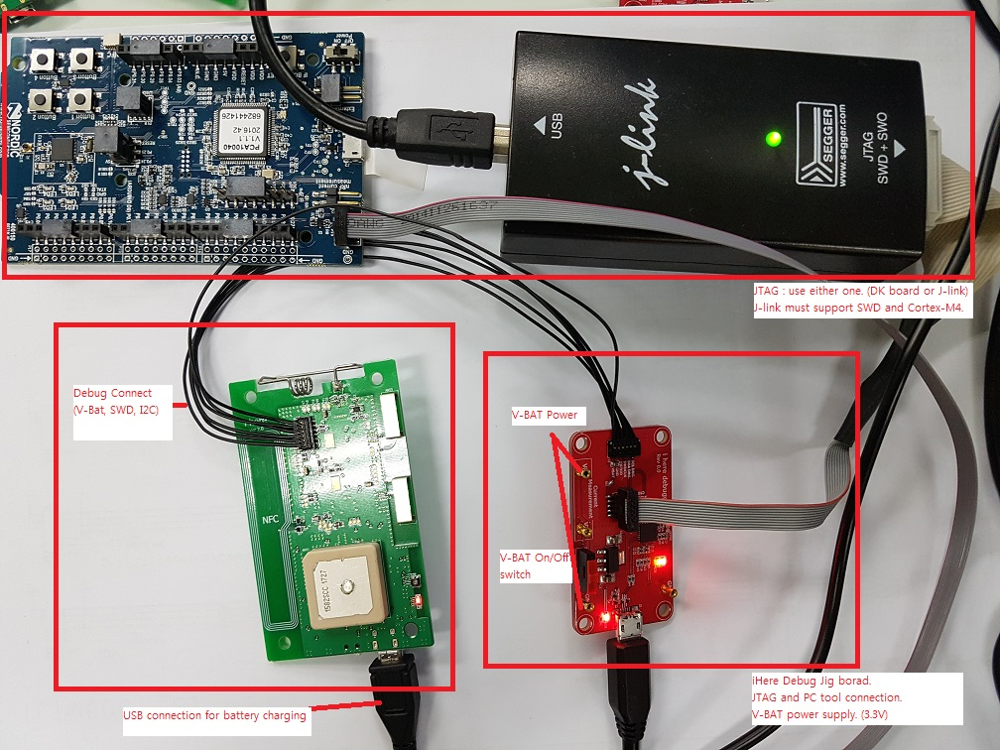
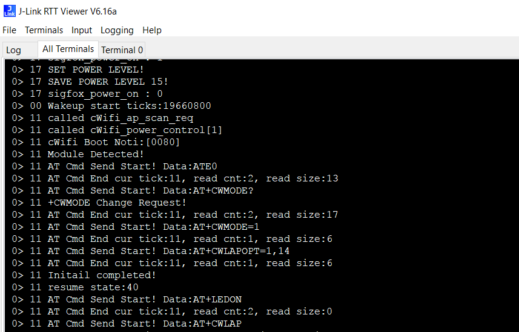

# Introduction

The purpose of this tutorial is to help you getting started with Seongji Sigfox quad-mode module, how-to setup their SDK. 
Sigfox quad-mode module is including Sigfox connectivity, WiFi, BLE and GPS and multiple sensors (magnetic, temperature, accelerometer). 
The EVK also comes with an NFC tag. 
The main core of the module is based on the Nordic nRF52832 SOC. 
Seongji has developed an application layer on top of Nordic SDK to interact with all connectivity blocks and sensors. 
BLE can be directly programmed using Nordic SDK directives as it is embedded into the nRF52 chip.
- [nRF52 SDK Version Infomation](sdk_version.txt)
- Projects
  - development/SFM/demoApp : Basic Demo Application
  - development/SFM/demoApp_Simple : Simplified demoApp
  - development/SFM/demoBootloader : Boot Loader with DFU(BLE Fota)
- Extract of source file for development : run extract_src_files.cmd
- Delete files created at build time : run remove_unnecessary_files.cmd

# Issue
- __Acceleration sensor inside the module could be changed after around Q3, 2018 from BMA250E to BMA253.__
  - BOSH notified E.O.L of the BMA250E in Jan.,2018.
  - Main difference between two parts is resolution of the acceleration. 10bit for BMA250E and 12bit for BMA253.
  - Please refer to the application note for accelerometer. [BMA253_Datasheet](development/SFM/documentation/datasheet/Bosch_01242017_BMA253-1217713.pdf)

# Hardware
  - [Seongji Sigfox evaluation board](development/SFM/documentation/pics/SFM20R_EVB.jpg)
  - JLink/SWD cable
  - [nRF52 DK board](development/SFM/documentation/pics/nRF52_DK.jpg): optional, used as a master to connect to the Seongji dev kit using SWD. Can be bypassed if you own JTAG/SWD debugger probe.
  - [Block diagram](development/SFM/documentation/wssfm20r_block_20180226.pdf)

# SES (SEGGER Embedded Studio for windows)
[Development_Environment_Setup_Guide](development/SFM/documentation/manual/[SEONGJI]Development_Environment_Setup_Guide_V300.pdf)

# Architecture of the SDK
[AppNote_SFM20R_Architecture_of_SW](development/SFM/documentation/manual/[SEONGJI]AppNote_SFM_Architecture_of_SW_V300.pdf)

The Seongji SDK is based on top of Nordic nRF5x SDK. You will find the regular Nordic directories:
- components
- documentation
- examples
- external
- svd

In addition to them, Seongji SDK has been created into the __development/SFM__ directory, including the following:
- binary
  - download_APP.cmd : app fw write via JLink.
  - download_Factory.cmd : all fw write after erase flash via JLink.
  - DFU_packages : DFU package for over-the-air update via BLE
  - factory_download_images : for factory_download

- [documentation](development/SFM/documentation) : Seongji [manuals](development/SFM/documentation/manual/) and application notes
- demoBootloader : source code for the bootloader (already flashed on the module)
- demoApp : this is a more complete example. The application starts by broadcasting a BLE beacon. Then it scans WiFi band and sends BSSID with highest RSSI using Sigfox. Afterwards, if a GPS location has been detected it is also sent using Sigfox. This process is repeated every 10 minutes by default.
- common/src, common/lib : common source files and lib
- common/config : defines
- demoApp/pca10040/s132/ses,  demoBootloader/pca10040/s132/ses : project files for SES

# Support Modules and devices
### need to modify "development/common/config/cfg_config_defines.h"
##### modules Defines (need to modify MODEL_NAME, MODULE_TYPE)
```
SFM20R : MODEL_NAME to "SFM20R" and MODULE_TYPE to CDEV_MODULE_SFM20R
SFM60R : MODEL_NAME to "SFM60R" and MODULE_TYPE to CDEV_MODULE_SFM60R
SRM200A : MODEL_NAME to "SRM200" and MODULE_TYPE to CDEV_MODULE_SRM20
```
##### Device Defines (need to modify CDEV_BOARD_TYPE)
```
#define CDEV_BOARD_EVB                           (1)
#define CDEV_BOARD_IHERE                         (2)
```
##### eg. (Do not change comments and spaces)
```
"SFM20R EVB"
#define CDEV_MODEL_NAME "SFM20R"   //MODEL NAME SIZE IS 6BYTE
#define CDEV_MODULE_TYPE                        CDEV_MODULE_SFM20R
#define CDEV_BOARD_TYPE                          CDEV_BOARD_EVB  //REPLACE_DEVICE_DEFINE_HERE
```

##### There is a batch file to change the target.

```
eg. SFM20R EVB
development/SFM/demoApp/changeConfig_SFM20R_EVB.cmd
```

### Flashing the module
Seongji SDK includes Nordic tools and flash the code for Windows.
- development/SFM/binary/ (after build with SES)
- How to use J-LINK with DK board (EVB)

- How to use J-LINK (iHere)


### How to flash the application via DFU

[](https://youtu.be/YftrZyONju8)

### Debugging via JLink/SWD

To debug messages via SWD link, J-Link software must be installed first.
For Windows, starts the program J-Link RTT Viewer with following parameters


Once connected, debug messages will be displayed in the terminal window.

The debug messages are printed with the function ```cPrintLog()```



### RTT Command with EVB
```
"CC" : Connect RTT over cTBC (use PC Tool)
"CR" : Reset
"CF" : Setting Value Reset
"CMx" : set bootmode (x-0:normal, 1:wifi rf test, 2:wifi always on, 3:ble test, 4:gps test mode, 5:wifi rf test bridge from RTT to uart, 6:sigfox over RTT, 7:sigfox over Uart, 8:WIFI AP(SFMTEST0000) and BLE BEACON)
"CL" : debug log get
```

